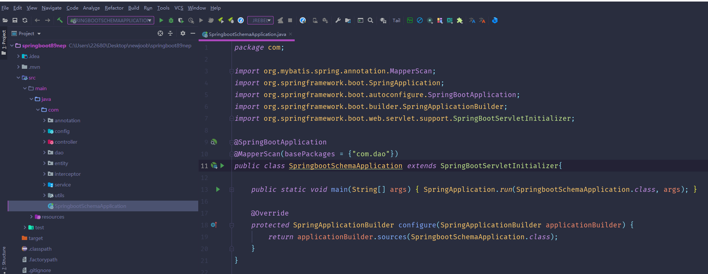
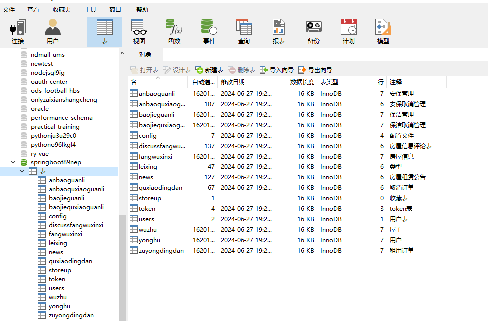
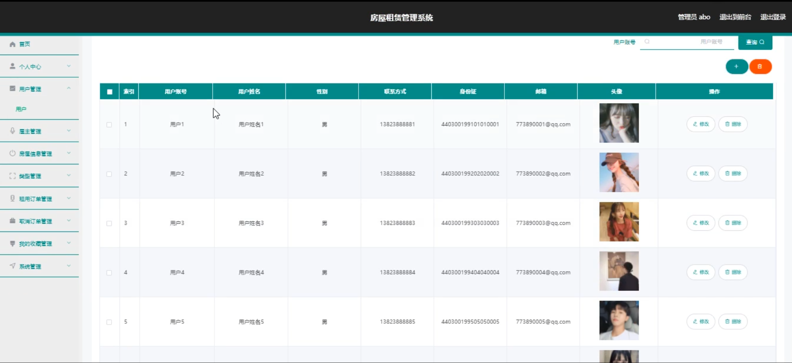
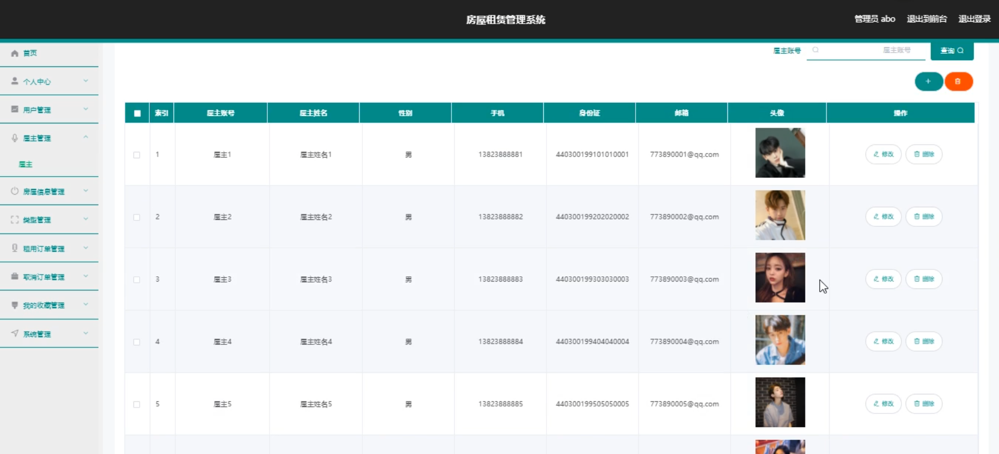
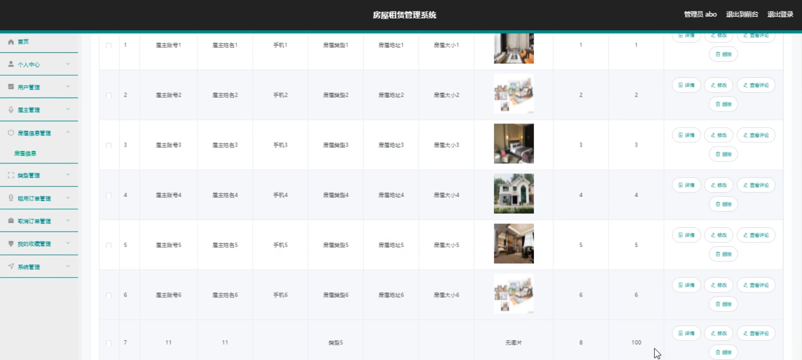
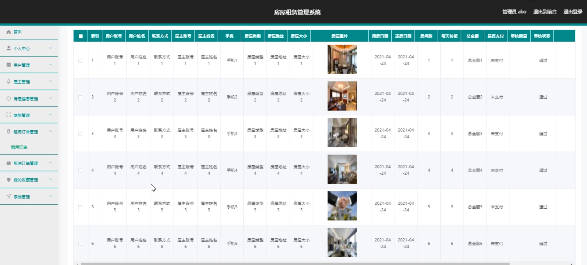
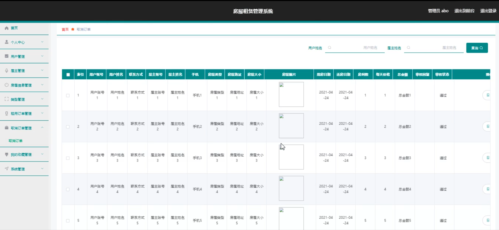
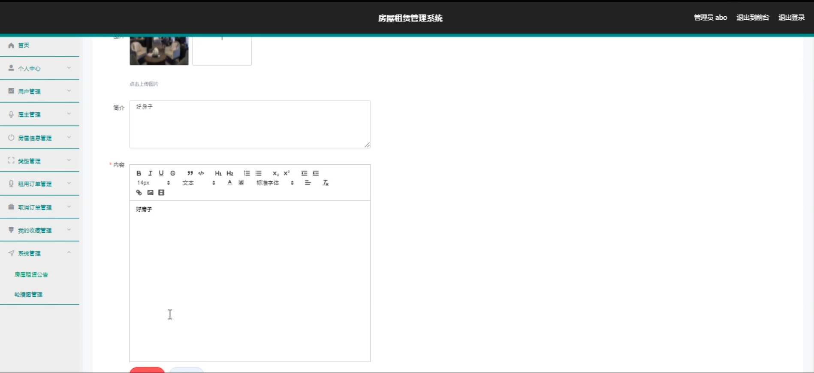
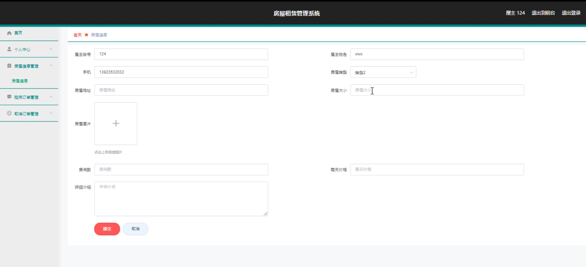
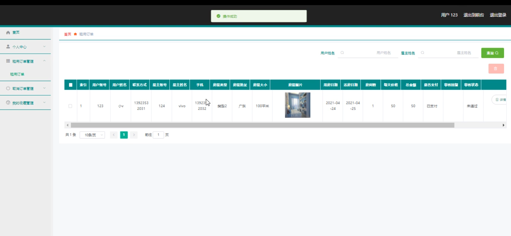

# 基于springboot的房屋租赁管理系统

#### 介绍

随着城市化进程的加速和人口流动的增加，房屋租赁市场日益活跃。为了提高房屋租赁的效率和管理水平，满足租客、屋主和管理者的需求，本基于 Spring Boot 的房屋租赁管理系统应运而生。该系统旨在提供一个便捷、高效、安全的房屋租赁管理平台，实现租赁信息的精准匹配和流程的规范化管理。

#### 技术栈

后端技术栈：Springboot+Mysql+Maven

前端技术栈：Vue+Html+Css+Javascript+ElementUI

开发工具：Idea+Vscode+Navicate

#### 系统功能介绍

（一）管理端  
个人中心：管理端人员可以查看和编辑个人信息，接收系统通知和重要消息。  
用户管理：审核和管理租客和屋主的注册信息，包括身份验证、资料审核等。  
屋主管理：对屋主的基本信息、信用记录等进行管理，确保屋主的合法性和可靠性。  
房屋信息管理：全面掌握房屋的详细信息，如位置、面积、户型、设施等，进行添加、修改和删除操作。  
类型管理：对房屋的类型进行分类，如公寓、别墅、单间等，方便用户筛选和查找。  
租用订单管理：处理租客的租用订单，包括订单确认、合同签订、费用收取等环节。  
取消订单管理：处理租客或屋主提出的取消订单请求，按照规定进行相关操作和费用结算。  
我的收藏管理：管理自己收藏的优质房屋或重要信息。  
系统管理：进行系统的参数设置、权限分配、数据备份与恢复、安全防护等操作，保障系统的稳定运行和数据安全。  
（二）屋主端  
房屋信息：发布和更新自己房屋的详细信息，包括照片、描述、租金等。  
房屋租赁公告：查看平台发布的关于租赁政策、法规、优惠活动等公告。  
个人中心：修改个人资料，设置房屋出租偏好，查看租赁记录和收益情况。  
后台管理  
房屋信息管理：随时调整房屋的出租状态和相关信息。  
租用订单管理：处理租客的租用请求，与租客沟通协商。  
取消订单管理：处理因特殊情况导致的订单取消事宜。  
（三）用户端  
房屋信息：浏览平台上的各类房屋信息，根据需求进行筛选和比较。  
房屋租赁公告：及时了解平台的最新通知、优惠政策和市场动态。  
个人中心：修改个人信息，管理租赁偏好，查看租赁历史和订单状态。  
后台管理  
房屋信息管理：收藏感兴趣的房屋，方便后续查看和比较。  
租用订单管理：提交租用申请，跟踪订单处理进度，进行支付操作。  
取消订单管理：在特定条件下取消已提交的订单。  

#### 系统作用

提高租赁效率  
租客能够快速找到符合需求的房屋，屋主能够及时出租房屋，减少房屋闲置时间。  
自动化的订单处理流程大大缩短了租赁交易的时间。  
规范租赁市场  
严格的用户管理和信息审核机制，保障了租赁交易的合法性和安全性。  
统一的租赁流程和规范，减少了纠纷和违规行为的发生。  
优化资源配置  
系统能够根据用户需求和市场情况，合理分配房屋资源，提高房屋的利用率。  
为屋主提供更多的出租渠道，为租客提供更多的选择，实现资源的最优配置。  
提升服务质量  
租客和屋主可以通过系统及时反馈问题和建议，促进平台服务的不断改进。  
管理端能够通过数据分析和监控，及时发现和解决租赁过程中的问题，提升整体服务水平。  

#### 系统功能截图

代码结构

数据库表

登录

用户管理

屋主管理

房屋信息管理

租用订单管理

取消订单管理

系统管理

前台页面首页

个人中心

屋主端后台管理

用户端后台管理

#### 总结

本基于 Spring Boot 的房屋租赁管理系统，通过清晰的角色划分和丰富的功能模块，实现了房屋租赁管理的信息化、规范化和高效化。为租客、屋主和管理者提供了便捷、可靠的服务，促进了房屋租赁市场的健康发展。未来，随着技术的不断进步和市场需求的变化，系统将持续优化和升级，为用户提供更优质、更智能的房屋租赁体验。

#### 使用说明

创建数据库，执行数据库脚本 修改jdbc数据库连接参数 下载安装maven依赖jar 启动idea中的springboot项目

后台地址：http://localhost:8080/springboot89nep/admin/dist/index.html

管理员  abo 密码 abo

前台地址：http://localhost:8080/springboot89nep/front/index.html